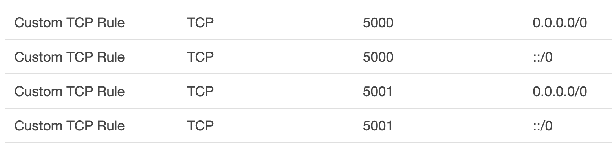
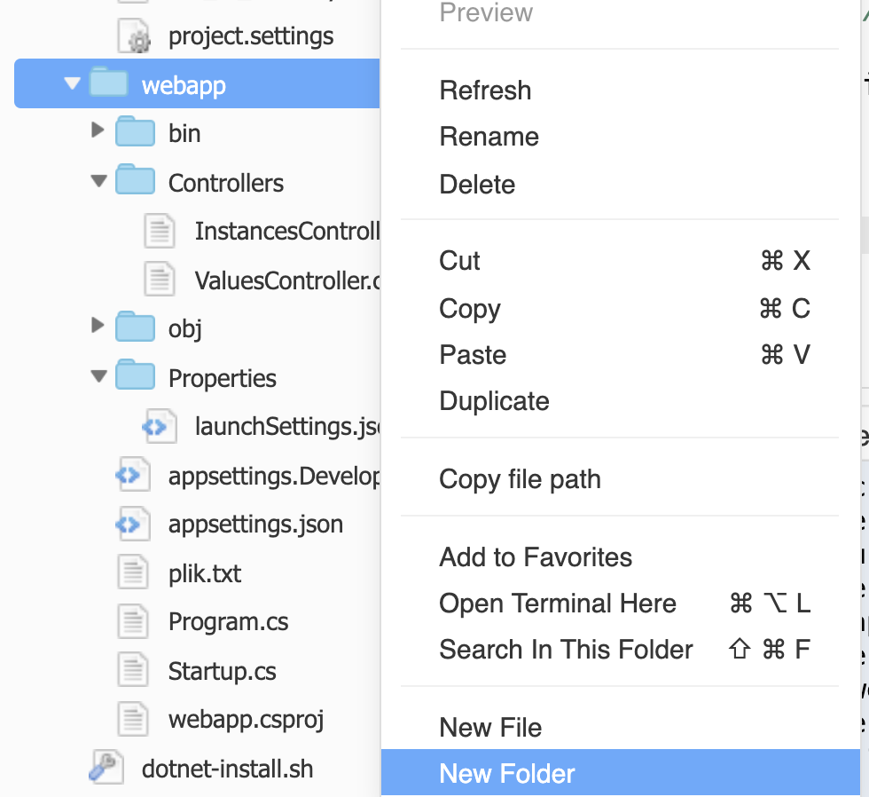
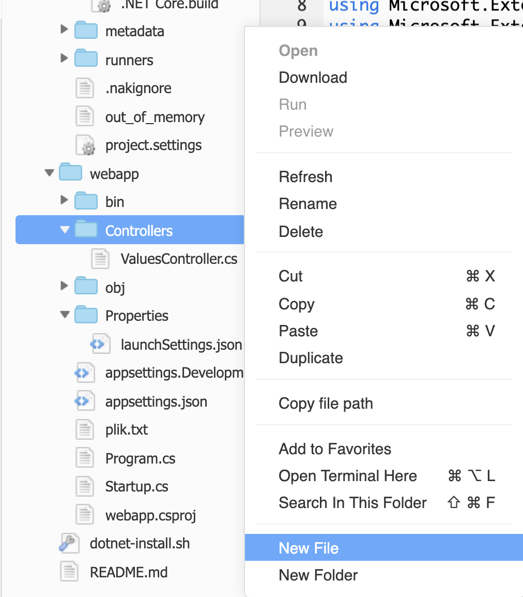

<br><br>
<br><br>
<br><br>

# Configuring .NET Core for AWS

## LAB Overview

#### In this lab you will learn how to configure your web api application on AWS.

## Task 1: Starting development environment
In this task you will start your Cloud9 environment.

1. Open your exixsting **Cloud9** environment. 
2. Verify that *dotnet* is already installed by typing following command:
```
dotnet --help
```
If successful, the .NET Core 2 SDK version number is displayed. If the version is less than 2.0, or if an error such as bash: ``dotnet: command not found`` is displayed, install the .NET Core 2 SDK. 

## Task 2. Creating web api .NET Core app

In this task you will create simple web api application.

3. Enter your environment dictionary by typing:
```
cd ~/environment/
```
4. Create and enter a new directory:
```
mkdir webapp
cd webapp
```
5. Create a .NET Core web api project:
```
dotnet new webapi -lang C#
```
6. From the Environment window in the AWS Cloud9 IDE, open the Program.cs file. In the editor, replace the file's  contents with the [Program.cs file](Program.cs), and then save the Program.cs file. 

## Task 3. Building and running the code.

In this tak you will add both builder and runner to your Cloud9 IDE. Then you will run the app.

If you have already created both .NET Core builder and runner, please skip to step 20.

If you do not want to use Cloud9 builder or runner you can always use terminal window and ryn the app by typing:
```dotnet build```
and
``dotnet run```.

7. On the Cloud9 menu, choose **Run*, **Build System**, **New Build System**.
8. On the *My Builder.build* tab, replace the tab's contents with the following code.
```
{
  "cmd" : ["dotnet", "build"],
  "info" : "Building..."
}
```
9. Click **File**, **Save As*.
10. For **Filename**, type *.NET Core.build*.
11. For **Folder**, type */.c9/builders*.
12. Click **Save**.
13. With the contents of the *Program.cs* file displayed in the editor, click **Run**, **Build System, .NET Core**. Then choose **Run**, **Build**.
14. On the menu bar, choose **Run*, **Run With**, **New Runner**.
15. On the **My Runner.run** tab, replace the tab's contents with the following code.
```
{
  "cmd" : ["dotnet", "run", "$args"],
  "working_dir": "$file",
  "info" : "Running..."
}
```
16. Choose **File**, **Save As**.
17. For **Filename**, type *.NET Core.run*.
18. For **Folder**, type */.c9/runners*.
19. Choose Save.
20. Run the application
* With the contents of the *Program.cs* file displayed in the editor, choose **Run** -> **Run With** -> **.Net Core**. 

If the app did not start, please check working direcory in your runner tab.

## Task 4. Opening security groups

In this task tou will open ports 5000 and 5001 in the security group connected to your Cloud9 EC2 machine.

21. In the AWS console, click on the **Services** menu and choose **EC2**.
22. Click **Running instances**.
23. Find your VM and click on its name.
24. Scroll down to *security groups** and click on the *security group name*.
25. Add both port 5000 and 5001 as open for everyone.



26. Move back to the EC2 decsription view and copy its public IP address.
27. Open the browser of your choice and as an url enter following:
```
https://<IP-OF-YOUR-MACHINE>:5001/api/values
```

Now you should have the response from your .NET Core api.

## Task 5. Adding AWS SDK and configuring the app 

28. Stop your application by pressing *CTRL+C*.
29. To use the Configuration object to get the AWS options, first add the AWSSDK.Extensions.NETCore.Setup NuGet package by typing
```
dotnet add package AWSSDK.Extensions.NETCore.Setup
```
in the terminal window.

30. In the editor, look for *appsettings.json* and *appsettings.Development.json* files.
31. Add following setting (default AWS region) to the file:
```
"AWS": {
    "Region": "eu-west-1"
  },
```
Now it sould be similiar to
```
{
  "Logging": {
    "LogLevel": {
      "Default": "Warning"
    }
  },
  "AWS": {
    "Region": "eu-west-1"
  },
  "AllowedHosts": "*"
}
```
32. If you need credentials to work with aws you can also add them to the file. Instead of previous setting, you can add both region and profile configured on your instance:
```
"AWS": {
  "Profile": "tsrdev",
  "Region": "eu-west-1"
},
"AllowedHosts": "*"
```
Remember, you must have the profile already onfigured on your instance.
33. From the Environment window in the AWS Cloud9 IDE, open the Startup.cs file. In the editor
34. Add 
```
using Amazon
```
at the top of the file.
35. In the *ConfigureServices* method add:
```
services.AddDefaultAWSOptions(Configuration.GetAWSOptions());
```
36. Still in your application directory type following command into your terminal window
```
dotnet add package AWSSDK.EC2
```
37. Now you can add Amazon.EC2 client to your app. Open *Startup.cs* file once again, add
```
using Amazon.EC2
```
at the top of the file.
38. Still in the *Startup.cs* file add
```
services.AddAWSService<IAmazonEC2>();
```
to the *ConfigureServices* method.

Now you can use the EC2 client in your app.

## Task 6. Adding new code

In this task you will add code to list all EC2 instances and return the list as a response.

39. Right click on your app folder and choose **New Folder**.



40. Enter a name for the catalog *Services*.
41. Right click on the newly created catalog and add a file. Enter a name *IEC2Service.cs*.
42. Open *IEC2Service.cs*, download [IEC2Service.cs](IEC2Service.cs) file and paste its content into editor.
43. Once again right click on *Services* catalog and create new file *EC2Service.cs*.
44. Open the file, download [EC2Service.cs](EC2Services.cs) file and paste its content into editor. 
45. Right click on the *Controllers* folder and choose **New File**.



46. Enter a name for the file *InstancesController.cs* and open it in the editor.
47. Download [ImageController.cs](ImageController.cs) file and paste its content into editor.
48. Select **Files** and **Save All**.
49. Open *Startup.cs* file again, and add following line to 
'''
services.AddScoped<IEC2Service, EC2Service>();
'''
to *ConfigureServices* method.

You can also download [Startup.cs](Startup.cs) file and use its content as a source code by copying it to Cloud9 environment.

50. At the top of the file add
```
using webapp.services
```
## Task 6. Running the app

51. Once again fing the IP address of your Cloud9 instance.
52. Open any browser of your choise and open url:
```
https://<IP-OF-YOUR-MACHINE>:5001/api/instances
```

You should get a list of EC2 instances created in your AWS account (eu-west-1 region).

If there is any error, check if your Cloud9 environment is set to manage your temporary AWS credentials.
## END LAB

<br><br>

<center><p>&copy; 2019 Chmurowisko Sp. z o.o.<p></center>
