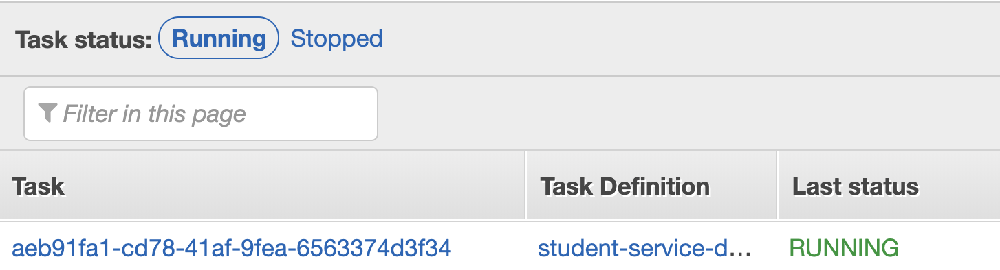
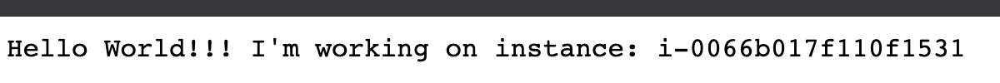
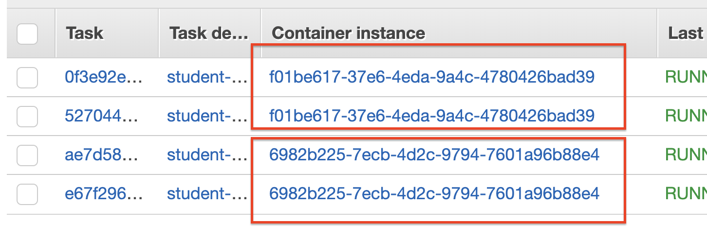
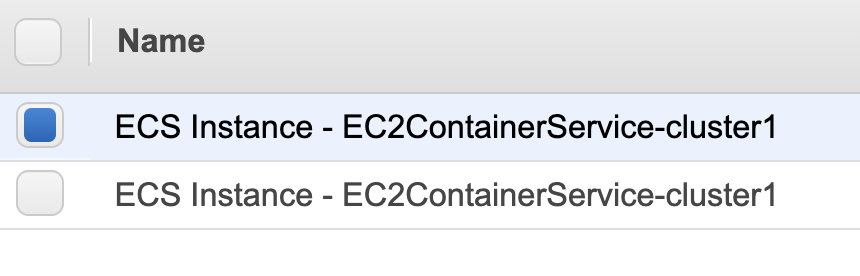
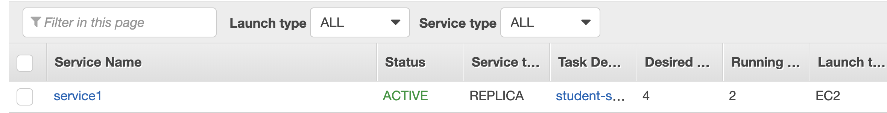
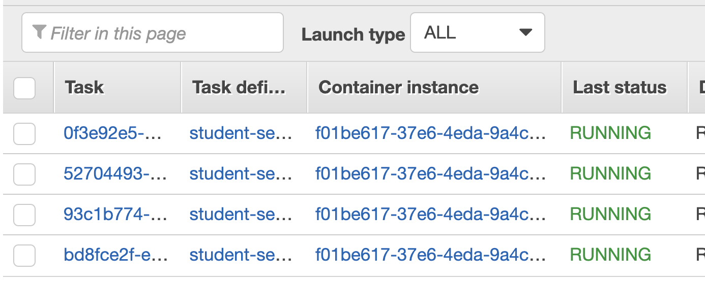

  
  
  

# Creating ECS Service

## LAB Overview

#### During this lab you will prepare an ECS Service. Then you will test AZ outage.

## Task 1: Preparing a Task definition

1. On the **Services** menu, click **ECS**.
2. Click **Task definitions**.
3. Click **Create new Task Definition**.
4. Select **EC2** and click **Next step**.
5. Enter a **Task Definition Name**, *student-X-service-definition*.
6. Click **Add container**.
7. Enter a **Container name**, *student-X-service-container*.
8. Enter *przemekmalak/netcoreapi* your image URI.
9. Select **Hard Limit** for **Memory Limits** and set it to *128*.
10. Set **|Port mappings** as:
* **Host port**: 80,
* **Container port**: 80.
11. Scroll aodn and click **Add**.
12. Leave the rest unchanged, click **Create**.

## Task 2: Cretaing service.

14. Click **Clusters**.
15. Find your cluster and click on it's name.
16. Select **Services** and click **Create**.
17. Select **EC2** as **Launch type**.
18. Select your definition created in previous task as **Task definition**.
19. Eneter a **Service name** for your service.
20. Set **Service type** to **Replica**.
21. Enter *1* as **Number of tasks**.
22. Leave the rest unchanged and click **Next step**.
23. Set **Load balancer type** to **None**.
24. Uncheck **Enable service discovery integration**.
25. Click **Next step**.
26. Click **Next step**.
27. Click **Create service**.
28. Click **View Service**.

## Task 3: Examining service

In this task you will check if the setrvice is working.

29. In the service pane click **Tasks**.
30. Click on the task identifier.

31. Scroll down to **Containers** and unwind yout container data.
32. Find IP address of your container and paste it into any browser. Add "/hello" to the path and try connecting your service.

You should have your service up and running.

## Task 4: Creating HA solution

In this task you will add additional tasks to the service to make it hhigh available.

First, you have to change the task definition. You need to set dynamic port mapping. No two or more containers can use the same port mapping on one ECS host.

33. Click **Task definitions**.
34. Check the checkmark left to your task definition.
35. Click **Create new revision**.
36. Scroll down to your container and clikk on its name.
37. Set **|Port mappings** as:
* **Host port**: 0,
* **Container port**: 80.
38. Click **Update**.
39. Click **Create**.

Now you need to change your service settings.

40. Click **Clusters**.
41. Find your cluster and click on its name.
42. Select **Services**.
43. Select the checkmark left to your service and click **Update**.
44. Set **Task Definition - Revision** to *latest**.
45. Scroll down and set **Number of tasks** to 4.
46. Click **Next step**.
47. Click **Next step**.
48. Click **Next step**.
49. Click **Update Service**.
50. Click **View Service**.

After a few seconds you should have 4 tasks running.

Look into Container instances. Your tasks are spread across both ECS instancess in two availability zones.

51. Click on both **Container instance** identifiers and check of the insances are placed in different availability zones.

## Task 5: Testing service availability

In this task you will "prepare" AZ outage. Then ECS should use instances already available in your cluster.

52. On the **Services** menu, click **EC2**.
53. Click **Running instances**.
54. Find instances that belong to your cluster. They should have cluster name inside their name.
55. Check the checkmarf left to one of them.

56. Click **Actions**.
57. Select **Instance state**.
58. Click **Terminate**.
59. Click **Yes, Terminate**.
60. Go back to your service settings pane.

Now there should be 2 tasks running.

61. Wait a few seconds, refresh the view. You should get 4 tasks running again. Please, look into **Container instance** idenfifiers.

Now all tasks use the same ECS instance.

If you look at your EC2 instances once again, now you should have 2 of them working again. Unfortunatelly, ECS wont use them automatically. 

Please, delete the service when you're ready.

## END LAB

  

&copy; 2019 Chmurowisko Sp. z o.o.

