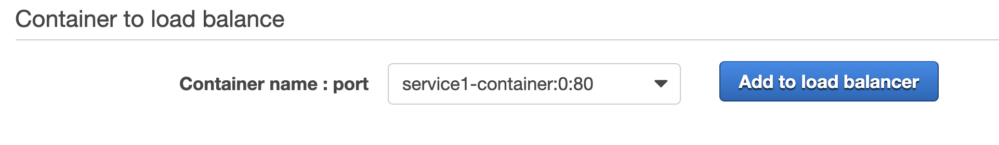
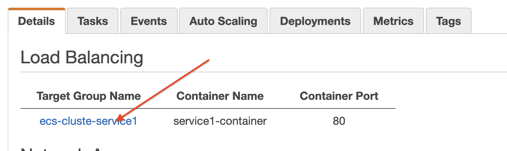
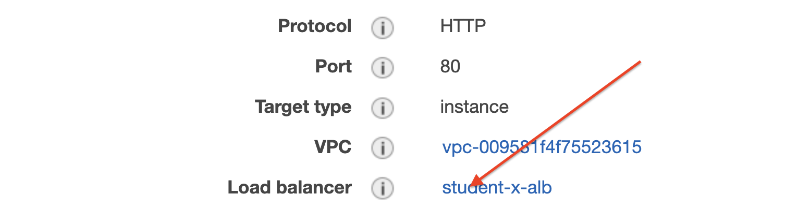
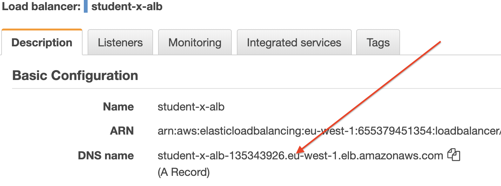
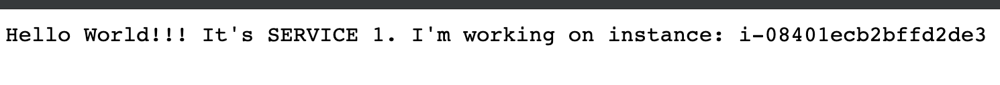
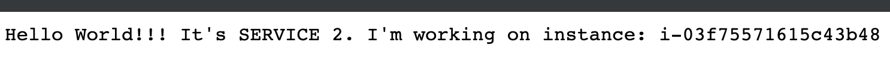

  
  
  

# ECS with Application Load Balancer

## LAB Overview

#### During this lab you will  use ECS to run and autoscale your service. All ECS tasks will be availble through Application Load Balancer.

## Task 1: Creating Load Balancer

1. On the **Services** menu, click **EC2**.
2. On the left panel click **Load balancers**.
3. Click **Create Load Balancer**.
4. Select **Application Load Balancers** and click **Create**.
5. Enter a name for your load balancer: *student-X-ALB*.
6. Select the VPC you have ECS cluster in and add all subnets.
7. Click **Next: Configure Secutiry Settings**.
8. Click **Next: Configure Secutiry Groups**.
9. Select **Create a new security group**.
10. Select *HTTP* as **Type**, *80* as **Port range** and *Anywhere* as **Source**.
11. Click **Next: Configure Routing**.
12. Select *New target group* as **Target group**.
13. Enter a name for your target group, "student-X-tg1".
14. Click **Next: Register Targets**.

Do not add any targets!!!.

15. Click **Next: Review**.
16. Click **Create**.
17. Click **Close**.

## Task 2: Preparing a Task definition

18. On the **Services** menu, click **ECS**.
19. Click **Task definitions**.
20. Click **Create new Task Definition**.
21. Select **EC2** and click **Next step**.
22. Enter a **Task Definition Name**, *student-X-service-definition*.
23. Click **Add container**.
24. Enter a **Container name**, *student-X-service-container*.
25. Enter *przemekmalak/netcoreapi* your image URI.
26. Select **Hard Limit** for **Memory Limits** and set it to *128*.
27. Set **|Port mappings** as:
* **Host port**: 0,
* **Container port**: 80.
28. Scroll down and click **Add**.
29. Leave the rest unchanged, click **Create**.

## Task 3: Cretaing service.

30. Click **Clusters**.
31. Find your cluster and click on it's name.
32. Select **Services** and click **Create**.
33. Select **EC2** as **Launch type**.
34. Select the task definition you created in previous task.
35. Enter a name for your service.
36. Leave **Service type** unchanged as **Replica**.
37. Set **Number of tasks** to 2.
38. Click **Next step**.
39. As **Load balancer type** select **Application Load Balancer**.
40. As a **Load balancer name** select the load balancer you crearted in step 1.
41. Select a container which should be balanced and click **Add to load balancer**.

42. Set **Production listener port** to existing port **80:HTTP**.
43. Set **Path pattern** to */service1* and **Evaluation order
** to 1.
44. Scroll down and set **Healft check path** to */service1*.
45. Uncheck **Enable service discovery integration**.
46. Click **Next step**.
47. Click **Next step**.
48. Click **Create Service**.
49. Click **View Service**.
50. Click on **Target Group Name**.

51. Click load balancer name.

52. Find its DNS name and copy it.

53. Open any web browser and paste the DNA name of your ALB.

You'll get *503* error. Just add */service1* to the path and try again.

You shoulg get sometfing similiar to the following result.

Try reloading the page. The id of the instance should change. ALB is routing requests to both ECS instances.

## Task 4: Preparing a Task definition for second service

54. On the **Services** menu, click **ECS**.
55. Click **Task definitions**.
56. Click **Create new Task Definition**.
57. Select **EC2** and click **Next step**.
58. Enter a **Task Definition Name**, *student-X-service2-definition*.
59. Click **Add container**.
60. Enter a **Container name**, *student-X-service-container*.
61. Enter *przemekmalak/netcoreapi2* your image URI.
62. Select **Hard Limit** for **Memory Limits** and set it to *128*.
63. Set **|Port mappings** as:
* **Host port**: 0,
* **Container port**: 80.
64. Scroll down and click **Add**.
65. Leave the rest unchanged, click **Create**.

## Task 5: Cretaing second service.

66. Click **Clusters**.
67. Find your cluster and click on it's name.
68. Select **Services** and click **Create**.
69. Select **EC2** as **Launch type**.
70. Select the task definition you created in previous task.
71. Enter a name for your service.
72. Leave **Service type** unchanged as **Replica**.
73. Set **Number of tasks** to 2.
74. Click **Next step**.
75. As **Load balancer type** select **Application Load Balancer**.
76. As a **Load balancer name** select the load balancer you crearted in step 1.
77. Select a container which should be balanced and click **Add to load balancer**.
78. Set **Production listener port** to existing port **80:HTTP**.
79. Set **Path pattern** to */service2* and **Evaluation order
** to 2.
80. Scroll down and set **Healft check path** to */service2*.
81. Uncheck **Enable service discovery integration**.
82. Click **Next step**.
83. Click **Next step**.
84. Click **Create Service**.
85. Click **View Service**.

After a moment can go back to your browser and check both services using */service1* and */service2* paths.

Service 2 should return a little bit different text.

## END LAB

  

&copy; 2019 Chmurowisko Sp. z o.o.

