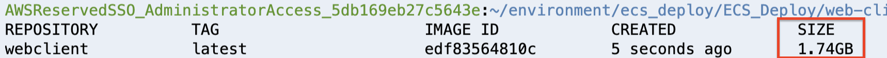
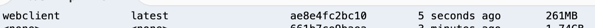
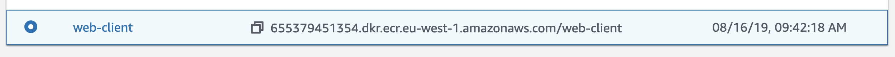

<br><br>
<br><br>
<br><br>

# Building docker images

## LAB Overview

#### In this lab you will build docker images using single and multistage building.

## Task 1: Building web-client
In this task you will bbuild web-client image using single stage building process.

1. Open your Cloud9 environment or any environment you use for this lab.
2. Clone the repository
```
git clone https://github.com/cloudstateu/ECS_Deploy.git
```
3. Enter the *web-client* directory:
```
cd ECS_Deploy/web-client/
```
4. Build docker image
```
docker build -t webclient:latest .
```
5. List available docker images:
```
docker images
```
Look into your docker image size


It's small web api application and it takes 1.74GB!

## Task 2: Building the image using multistage process.

6. Remove your current *Dockerfile**
```
rm Dockerfile
```
7. Use multistage Dockerfile to build image
```
mv Dockerfile_multi Dockerfile
```
8. Look into the file. 
We're using two steps building now. First we build our app using microsoft/dotnet:2.2-sdk image.

```
FROM microsoft/dotnet:2.2-sdk AS build
WORKDIR /app

COPY web-client.csproj .
RUN dotnet restore web-client.csproj

COPY . .
RUN dotnet publish -c Release -o out
```
Then, in the second step, bbuild atifacts are used together with smaller runtime image to create final docker image.
```
FROM microsoft/dotnet:2.2-aspnetcore-runtime AS runtime
WORKDIR /app
COPY --from=build /app/out ./
```
9. Build docker image once again using new Dockerfile
```
docker build -t webclient:latest .
```
10. List available docker images:
```
docker images
```
Now your image should be much smaller


## Task 3: Pushing image to ECR repository

In tihs task ypu will push your web-client image to your ECR repository.

11. In the AWS Management Console, on the **Services** menu, click **ECR**.
12. Find your web client repository and select it

13. Click **View push commands**.

I|n the next steps do not use commands from this tutorial. Pleas euse commands copied from the window you've just opened.

14. You need to login. Copy first command from the manual window
``
$(aws ecr get-login --no-include-email --region eu-west-1)
``
and paste it to your terminal.
15. Build the image
```
docker build -t web-client .
```
16. Tag the image using te third command from push commands window. It should look like:
``
docker tag web-client:latest 655379451354.dkr.ecr.eu-west-1.amazonaws.com/web-client:latest
``
17. Push the image to the repository using the fourth command ``docker push 655379451354.dkr.ecr.eu-west-1.amazonaws.com/web-client:latest``.
18. In the AWS console, close the **View push commands** window.
19. Click on your *web-client* repository. 
Now, you should have the image uploaded in the repository.

## Task 4: Building remaining images

In this task you will build and push images for the remaining two services.

The dockerfiles for both services are already prepared for multistage processes.

20. Enter the *service1* directory.
21. Repeat steps 15-17, nut please use commands related to your *service1* repository. You do nto have to log in again.
22. Enter the *service2* directory.
23. Repeat steps 15-17, nut please use commands related to your *service1* repository.
## END LAB

<br><br>

<center><p>&copy; 2019 Chmurowisko Sp. z o.o.<p></center>